# Phase 0 — Discovery and Shadowing

*For the case study: Phase 0 is simulated from CIM and synthetic data. For real deployment: mandatory.*

## Workflow Map (Current Quote Flow)

```mermaid
flowchart LR
  A[Inquiry received] --> B[Read email and attachments]
  B --> C[Interpret drawings and specs]
  C --> D[Identify substrate and requirements]
  D --> E[Select coating family or prior jobs]
  E --> F[Check compliance and certs]
  F --> G[Estimate complexity and turnaround]
  G --> H[Build quote or technical reply]
  H --> I[Human approval and send]
```

- **Intake:** Customer sends email with attachments (drawings, PDFs, spec sheets).
- **Interpretation:** Estimator/technical lead reads files, infers substrate, part properties, required performance.
- **Selection:** Match to coating families or analogous historical jobs (tribal knowledge).
- **Gaps:** Identify missing info before quoting; check compliance/cert requirements.
- **Estimate:** Complexity, routing, masking, racking, testing, turnaround.
- **Package:** Assemble quote or technical reply; get approval; send.

## Top 5 Pain Points

1. **Slow response** — Manual reading of messy customer files; context built from scratch each time.
2. **Missing info at quote time** — Critical details (substrate, certs, dimensions) discovered late, causing rework or lost deals.
3. **Bad-fit jobs** — Coating or process chosen without enough similarity to prior jobs; margin or quality issues.
4. **Underquoted complexity** — Masking, testing, or cert requirements understated in initial quote.
5. **Compliance uncertainty** — Cert and customer-specific requirements not consistently checked against internal rules.

## Final Definition of Quote Review Packet (Six Sections)

1. **Inquiry summary** — Customer, part, quantity, end-use, requested turnaround, key requirements.
2. **Extracted technical facts** — Suspected substrate/material, dimensions if available, coating-related requirements, temperature/chemical/wear/corrosion context, cert signals, missing fields.
3. **Similar historical jobs** — Top 3–5 prior jobs with similar part/application/coating/industry; prior cycle time / margin / quality notes; **with source references (job IDs)**.
4. **Recommended coating paths** — Ranked candidate paths: likely coating family, why it may fit, why it may fail, uncertainty level, who should review (e.g. technical lead).
5. **Risk / missing-info flags** — Substrate unclear, masking complexity likely, cert requirement detected, coating may not match use case, quote should be reviewed by technical lead.
6. **Draft quote-prep checklist** — What a human must confirm before sending: material, part geometry, quantity, target performance, cert needs, testing required, packing/shipping/turnaround assumptions.

**Human actions:** Approve and edit | Request more info from customer (generated email) | Escalate to technical review.
